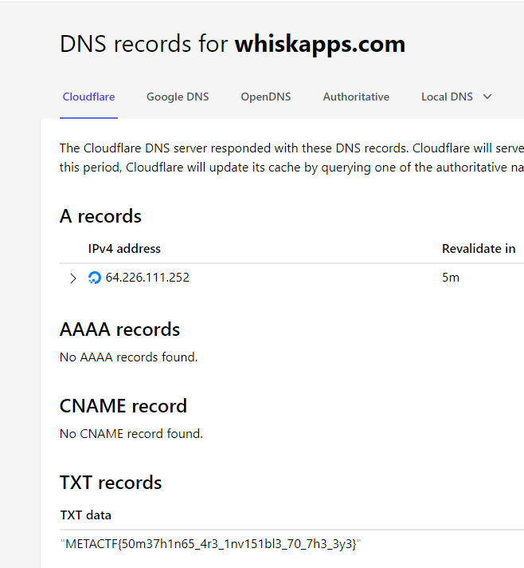

## Behind the inbox (ez)

1337 pts

During an ongoing investigation, we intercepted an email sent from a suspicious server. We have been noticing some strange behavior every time this email is opened, but we haven't been able to pin down the cause. Your task is to analyze this email and track down this entity.

**`Eatsmok`**

Hint: Something isn't being rendered ??? that's weird

[email.eml](./email.eml)

## Solve

opening `email.eml` as text we get the following

```
Content-Type: multipart/mixed; boundary="===============7160460087186955680=="
MIME-Version: 1.0
From: toremo9380@fitwl.com
To: RealEmail@Realestmailserver
Subject: Your Monthly Newsletter
X-Mailer: Microsoft Outlook Express 6.00.2600.0000
X-MSMail-Priority: High
X-Priority: 1
MIME-Version: 1.0
Content-type: multipart/mixed; boundary="===============7160460087186955680=="
X-MimeOLE: Produced By Microsoft MimeOLE V6.00.2600.0000
X-Spam-Status: No, score=-1.0 required=5.0 tests=ALL_TRUSTED
X-Spam-Score: -1.0
Reply-To: toremo9380@fitwl.com
Return-Path: toremo9380@fitwl.com
Received-SPF: pass (sender IP is 20.104.111.137)
Authentication-Results: mx.google.com; spf=pass (google.com: domain of RealEmail@Realestmailserver designates 20.104.111.137 as permitted sender) smtp.mailfrom=toremo9380@fitwl.com dkim=pass header.i=@yourserver.com
DKIM-Signature: v=1; a=rsa-sha256; c=relaxed/relaxed; d=RealEmail@Realestmailserver; s=selector; h=From:To:Subject:MIME-Version:Content-Type; bh=1234abcd; b=abcd1234
DMARC-Results: i=1; mx.google.com; spf=pass (google.com: domain of RealEmail@Realestmailserver designates 20.104.111.137 as permitted sender) smtp.mailfrom=toremo9380@fitwl.com; dmarc=pass (p=QUARANTINE sp=QUARANTINE dis=NONE) header.from=Realestmailserver.com
Date: Tue, 01 Jan 2023 12:00:00 +0000
Received: from yourserver.com (yourserver.com [20.104.111.137]) by Realestmailserver.com (Realestmailserver.com) with SMTP id 1234abcd; Tue, 01 Jan 2023 12:00:00 +0000
Reverse-DNS: Realestmailserver.com
Reply-To: RealEmail@Realestmailserver

--===============7160460087186955680==
Content-Type: text/html; charset="utf-8"
MIME-Version: 1.0
Content-Transfer-Encoding: base64

CjxodG1sPgo8aGVhZD4KPHN0eWxlPgpib2R5IHsKICAgIGZvbnQtZmFtaWx5OiBBcmlhbCwgc2Fu
cy1zZXJpZjsKICAgIGJhY2tncm91bmQtY29sb3I6ICNmNGY0ZjQ7CiAgICBtYXJnaW46IDA7CiAg
ICBwYWRkaW5nOiAwOwp9Ci5jb250YWluZXIgewogICAgd2lkdGg6IDgwJTsKICAgIG1hcmdpbjog
YXV0bzsKICAgIG92ZXJmbG93OiBoaWRkZW47Cn0KLmhlYWRlciB7CiAgICBwYWRkaW5nOiAzMHB4
OwogICAgYmFja2dyb3VuZDogIzUwYTZjMjsKICAgIGNvbG9yOiB3aGl0ZTsKICAgIHRleHQtYWxp
Z246IGNlbnRlcjsKfQouaGVhZGVyIGgxIHsKICAgIG1hcmdpbjogMDsKfQoubWFpbiB7CiAgICBw
YWRkaW5nOiAyMHB4OwogICAgYmFja2dyb3VuZDogd2hpdGU7CiAgICBjb2xvcjogIzU1NTU1NTsK
fQouZm9vdGVyIHsKICAgIHBhZGRpbmc6IDIwcHg7CiAgICBiYWNrZ3JvdW5kOiAjNTBhNmMyOwog
ICAgY29sb3I6IHdoaXRlOwogICAgdGV4dC1hbGlnbjogY2VudGVyOwp9Cjwvc3R5bGU+CjwvaGVh
ZD4KPGJvZHk+CjxkaXYgY2xhc3M9ImNvbnRhaW5lciI+CiAgPGRpdiBjbGFzcz0iaGVhZGVyIj4K
ICAgIDxoMT5Zb3VyIE1vbnRobHkgTmV3c2xldHRlcjwvaDE+CiAgPC9kaXY+CiAgPGRpdiBjbGFz
cz0ibWFpbiI+CiAgICA8aDI+SGVsbG8sPC9oMj4KICAgIDxwPldlbGNvbWUgdG8gb3VyIG1vbnRo
bHkgbmV3c2xldHRlciEgV2UndmUgZ290IGEgdG9uIG9mIGV4Y2l0aW5nIG5ld3MgdG8gc2hhcmUg
d2l0aCB5b3UgdGhpcyBtb250aC4gQ2hlY2sgb3V0IG91ciBsYXRlc3QgYXJ0aWNsZXMgYW5kIHVw
ZGF0ZXM6PC9wPgogICAgPHVsPgogICAgICA8bGk+PGEgaHJlZj0iaHR0cHM6Ly9lbi5yb3lhbmV3
cy50di9uZXdzLzQyNjg1LzIwMjMtMDYtMjYiPkFydGljbGUgMTwvYT48L2xpPgogICAgICA8bGk+
PGEgaHJlZj0iaHR0cHM6Ly9lbi5yb3lhbmV3cy50di9uZXdzLzQyNjk4LzIwMjMtMDYtMjYiPkFy
dGljbGUgMjwvYT48L2xpPgogICAgICA8bGk+PGEgaHJlZj0iaHR0cHM6Ly9lbi5yb3lhbmV3cy50
di9uZXdzLzQyNjk5LzIwMjMtMDYtMjYiPkFydGljbGUgMzwvYT48L2xpPgogICAgICA8bGk+PGEg
aHJlZj0iaHR0cHM6Ly9lbi5yb3lhbmV3cy50di9uZXdzLzQyNzAwLzIwMjMtMDYtMjYiPkFydGlj
bGUgNDwvYT48L2xpPgogICAgICA8bGk+PGEgaHJlZj0iaHR0cHM6Ly9lbi5yb3lhbmV3cy50di9u
ZXdzLzQyNjgxLzIwMjMtMDYtMjUiPkFydGljbGUgNTwvYT48L2xpPgogICAgICA8bGk+PGEgaHJl
Zj0iaHR0cHM6Ly9lbi5yb3lhbmV3cy50di9uZXdzLzQyNjg3LzIwMjMtMDYtMjYiPkFydGljbGUg
NjwvYT48L2xpPgogICAgICA8bGk+PGEgaHJlZj0iaHR0cHM6Ly9lbi5yb3lhbmV3cy50di9uZXdz
LzQyNjkzLzIwMjMtMDYtMjYiPkFydGljbGUgNzwvYT48L2xpPgogICAgICA8bGk+PGEgaHJlZj0i
aHR0cHM6Ly9lbi5yb3lhbmV3cy50di9uZXdzLzQyNjc5LzIwMjMtMDYtMjUiPkFydGljbGUgODwv
YT48L2xpPgogICAgPC91bD4KICAgIDxwPkFsc28sIGNoZWNrIG91dCB0aGVzZSBncmVhdCBwcm9k
dWN0cyBmcm9tIG91ciBzcG9uc29yczo8L3A+CiAgICA8aW1nIHNyYz0iaHR0cHM6Ly9pbWFnZXMu
dW5zcGxhc2guY29tL3Bob3RvLTE0NTExODc1ODA0NTktNDM0OTAyNzljMGZhP2l4bGliPXJiLTQu
MC4zJml4aWQ9TTN3eE1qQTNmREI4TUh4d2FHOTBieTF3WVdkbGZIeDhmR1Z1ZkRCOGZIeDhmQSUz
RCUzRCZhdXRvPWZvcm1hdCZmaXQ9Y3JvcCZ3PTExNzImcT04MCIgd2lkdGg9IjUwMCIgaGVpZ2h0
PSIyMDAiIC8+CiAgICA8aW1nIHNyYz0iaHR0cHM6Ly9pbWFnZXMudW5zcGxhc2guY29tL3Bob3Rv
LTE1MjY0NzA2MDgyNjgtZjY3NGNlOTBlYmQ0P2l4bGliPXJiLTQuMC4zJml4aWQ9TTN3eE1qQTNm
REI4TUh4d2FHOTBieTF3WVdkbGZIeDhmR1Z1ZkRCOGZIeDhmQSUzRCUzRCZhdXRvPWZvcm1hdCZm
aXQ9Y3JvcCZ3PTEwNzQmcT04MCIgd2lkdGg9IjUwMCIgaGVpZ2h0PSIyMDAiIC8+CiAgICA8aW1n
IHNyYz0iaHR0cHM6Ly9pbWFnZXMudW5zcGxhc2guY29tL3Bob3RvLTE1MzEyNjY3NTI0MjYtYWFk
NDcyYjdiYmY0P2l4bGliPXJiLTQuMC4zJml4aWQ9TTN3eE1qQTNmREI4TUh4d2FHOTBieTF3WVdk
bGZIeDhmR1Z1ZkRCOGZIeDhmQSUzRCUzRCZhdXRvPWZvcm1hdCZmaXQ9Y3JvcCZ3PTExNzAmcT04
MCIgd2lkdGg9IjUwMCIgaGVpZ2h0PSIyMDAiIC8+CiAgICA8cD5Eb24ndCBmb3JnZXQgdG8gcGFy
dGljaXBhdGUgaW4gb3VyIHVwY29taW5nIGV2ZW50czo8L3A+CiAgICA8dWw+CiAgICAgIDxsaT48
YSBocmVmPSJodHRwczovL3Vuc3BsYXNoLmNvbS9waG90b3MvZ0VLTXN0S2ZaNnciPkV2ZW50IDE8
L2E+PC9saT4KICAgICAgPGxpPjxhIGhyZWY9Imh0dHBzOi8vdW5zcGxhc2guY29tL3Bob3Rvcy8x
VGpPUlQyZExPdyI+RXZlbnQgMjwvYT48L2xpPgogICAgICA8bGk+PGEgaHJlZj0iaHR0cHM6Ly91
bnNwbGFzaC5jb20vcGhvdG9zL3JCQUF6M1JlVXVvIj5FdmVudCAzPC9hPjwvbGk+CiAgICAgIDxp
bWcgc3JjPSJodHRwOi8vd2hpc2thcHBzLmNvbS90ci5naWYiIHdpZHRoPSIxIiBoZWlnaHQ9IjEi
IC8+CiAgICA8L3VsPgogICAgPHA+U3RheSB0dW5lZCBmb3IgbW9yZSB1cGRhdGVzITwvcD4KICAg
IDxwPkJlc3QgUmVnYXJkcyw8L3A+CiAgICA8cD5Zb3VyU2VydmVyIFRlYW08L3A+CiAgPC9kaXY+
CiAgPGRpdiBjbGFzcz0iZm9vdGVyIj4KICAgIDxwPsKpIDIwMjMgUmVhbGVzdG1haWxzZXJ2ZXIu
IEFsbCByaWdodHMgcmVzZXJ2ZWQuPC9wPgogIDwvZGl2Pgo8L2Rpdj4KPC9ib2R5Pgo8L2h0bWw+
Cg==

--===============7160460087186955680==--

```

what matters most is the base64 which is the content of the email as html lets decode it

```html

<html>
<head>
<style>
body {
    font-family: Arial, sans-serif;
    background-color: #f4f4f4;
    margin: 0;
    padding: 0;
}
.container {
    width: 80%;
    margin: auto;
    overflow: hidden;
}
.header {
    padding: 30px;
    background: #50a6c2;
    color: white;
    text-align: center;
}
.header h1 {
    margin: 0;
}
.main {
    padding: 20px;
    background: white;
    color: #555555;
}
.footer {
    padding: 20px;
    background: #50a6c2;
    color: white;
    text-align: center;
}
</style>
</head>
<body>
<div class="container">
  <div class="header">
    <h1>Your Monthly Newsletter</h1>
  </div>
  <div class="main">
    <h2>Hello,</h2>
    <p>Welcome to our monthly newsletter! We've got a ton of exciting news to share with you this month. Check out our latest articles and updates:</p>
    <ul>
      <li><a href="https://en.royanews.tv/news/42685/2023-06-26">Article 1</a></li>
      <li><a href="https://en.royanews.tv/news/42698/2023-06-26">Article 2</a></li>
      <li><a href="https://en.royanews.tv/news/42699/2023-06-26">Article 3</a></li>
      <li><a href="https://en.royanews.tv/news/42700/2023-06-26">Article 4</a></li>
      <li><a href="https://en.royanews.tv/news/42681/2023-06-25">Article 5</a></li>
      <li><a href="https://en.royanews.tv/news/42687/2023-06-26">Article 6</a></li>
      <li><a href="https://en.royanews.tv/news/42693/2023-06-26">Article 7</a></li>
      <li><a href="https://en.royanews.tv/news/42679/2023-06-25">Article 8</a></li>
    </ul>
    <p>Also, check out these great products from our sponsors:</p>
    
    
    
    <p>Don't forget to participate in our upcoming events:</p>
    <ul>
      <li><a href="https://unsplash.com/photos/gEKMstKfZ6w">Event 1</a></li>
      <li><a href="https://unsplash.com/photos/1TjORT2dLOw">Event 2</a></li>
      <li><a href="https://unsplash.com/photos/rBAAz3ReUuo">Event 3</a></li>
      
    </ul>
    <p>Stay tuned for more updates!</p>
    <p>Best Regards,</p>
    <p>YourServer Team</p>
  </div>
  <div class="footer">
    <p>© 2023 Realestmailserver. All rights reserved.</p>
  </div>
</div>
</body>
</html>

```

we notice 1 weird thing, there's an img tag but its not rendering, ```` if we hit the url it doesnt load and takes a long time, lets do a lookup on the url ``whiskapps.com``

we can try `nslookup.io` awesome website to look up a domain names, we feed it our url, an what do you know, we got the flag!


