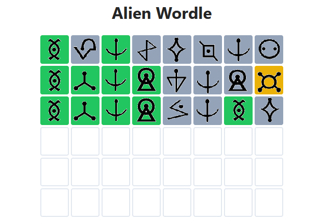
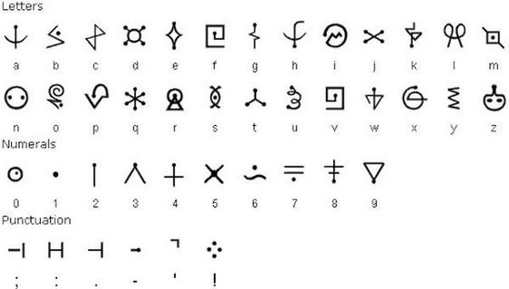

> ## I've got the same combination on my luggage! (ez)

### Description

Good news everyone! We have been tasked with deciphering a secret message from a less than friendly group of aliens! We know that they use the results of the popular " *Alien Wordle* " game as a key for their daily encryption method, that they love old human ciphers, and we got a copy of their game in progress. The bad news is, none of us can read alienese. Can you figure out the message?

Submit the result like this: shctf{decrypted_text_here}

### Files

**cipher.txt:**

> trt3_db_mz1gq_fekdf_x1ty

**Alien_Wordle.PNG**

### Solution

I've never seen these symbols before so first thing to do is find it, using google lens the app, or directly drag the image to google search bar and i found it quick:

replacing them we get `star..s.` with an extra misplaced `d` with some searching and guessing i found the closest wordle to be ***sratdust*** the challenge decription says that the flag is encrypted with an old cypher chatgpt gave me a list of old ciphers that take keys, i tryied:

* ceasar cipher
* Vigenere Cipher

`Ceasar` didnt give a flag, but then `Vigenere` did Flag-> shctf{byt3_my_sh1ny_metal_f1ag}
